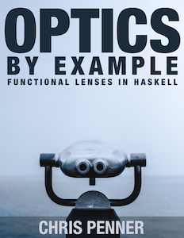

# lens-csv

* Docs are on [Hackage](http://hackage.haskell.org/package/lens-csv)

If you enjoy working with lenses (or need a hand learning how they work) my book [Optics By Example](https://leanpub.com/optics-by-example/) is a great place to learn more!

[](https://leanpub.com/optics-by-example/)

A lensy layer on top of Cassava which affords streaming, traversable, CSV parsing.

Still experimental (but working). Please file an issue if there are features the library doesn't support.

Example:

```haskell
>>> import Data.ByteString.Lazy as BL
>>> myCsv <- BL.readFile "./data/simple.csv"
>>> myCsv ^.. namedCsv . taking 2 rows . column @String "state_code" 
[ "NY"
, "CA"
]

>>> myCsv ^.. namedCsv . taking 2 rows . _NamedRecord @(M.Map String String)
[ fromList [("population","19540000"), ("state_code","NY")]
, fromList [("population","39560000"), ("state_code","CA")]
]

-- For csv files without headers
>>> myCsv ^.. csv . taking 2 rows . _Record @[String]
[ ["state_code", "population"]
, ["NY"        , "19540000"]
]

-- 'column' infers whether it's a named or unnamed csv and accepts the appropriate index type (either ByteString or Int)
>>> myCsv ^.. csv . rows . column @Int 1
[19540000,39560000]

-- Use traversals to edit cells 'in-place' (add 1337 to California's population)
>>> BL.putStrLn $ myCsv & namedCsv . row 1 . column @Int "population" +~ 1337
state_code,population
NY,19540000
CA,39561337
```
